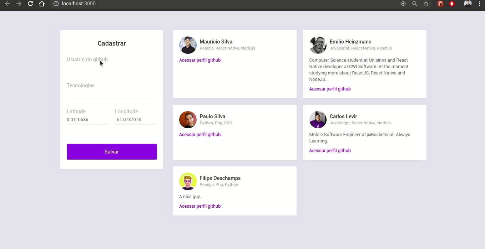
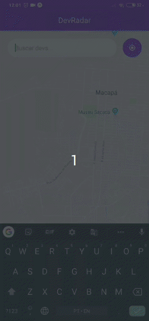

<h1 align="center">:round_pushpin:Dev Radar</h1>
The project aims to connect you to the nearest developers, 10km away, in real time, from the technology you are looking for.

## Previews app mobile and web

## Features
- **React Js** - A javascript library for building user interfaces. <a href="https://pt-br.reactjs.org/"><strong>about</strong></a> 
- **Expo** - Expo helps you create an Android and iOS app faster with Javascript behind it all. <a href="https://expo.io/"><strong>about</strong></a> 
- **React Native** - A lib that provides a way to create native apps for Android and iOS. <a href="https://facebook.github.io/react-native/"><strong>about</strong></a> 
- **Node Js** - A web framework for Node Js. <a href="https://nodejs.org/en/"><strong>about</strong></a> 
- **MongoDB** - A cross-platform and open-source document-oriented database. <a href="https://www.mongodb.com/"><strong>about</strong></a> 
- **Socket IO** - A library for realtime web applications. <a href="https://socket.io/"><strong>about</strong></a> 
- **Styled components** - Visual primitives for the component age. <a href="https://styled-components.com/"><strong>about</strong></a>
- **Unform** - Library for creating forms and validations in ReactJs<a href="https://github.com/Rocketseat/unform"><strong>about</strong></a> 

## Getting started
1. Clone this repo using ``
2. Enter directory: `cd omnistack` 
3. Run `yarn` to install dependencies 

### Getting started backend server
1. Enter folder: `cd backend`
2. Create a `.env` file and add the MongoDB url connection in MONGO_URL field
3. Run `yarn dev` to start the server

### Getting started with the frontend app

1. Move yourself to the frontend folder: `cd web`
2. Run `yarn start` to start the web application

### Getting started mobile app

1. Move yourself to the mobile folder: `cd mobile`
2. Run `yarn start`
3. With the 'expo' app installed, you scan the qrcode and run on Android or IOS.

